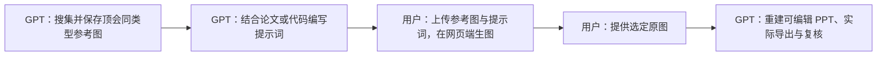

# GPT Paper Image

默认分工：GPT 完成参考图搜集、提示词设计与 PPT 重建；用户在网页端手动生成并选定图片。准备阶段交付可直接上传的参考图与可复制的提示词，收到原图后才继续转换。最终保存生成原图与原生可编辑 `.pptx`；整张图片放进幻灯片不算完成转换。

## 先确定内容与保存位置

阅读用户提供的原图、论文段落、方法说明、图注或相关代码，明确领域、图类型、受众、核心信息、画幅、必须出现的标签和因果连接。以论文主张和实际实现核对科学含义，二者冲突时列出待确认项，不自行补造机制。已有上下文足够时直接执行；只为影响科学含义或必要输入的问题澄清，同时继续独立检索工作。

区分新绘、重建改进与现状审计。用户只要求检查/归档时，保留原文件，执行适用检查并报告缺失和失败，不擅自修图或补造原始生图；完整生产流程的修正与交付要求不强加给只读审计。

用户已提供满意原图、只要求转 PPT 时，直接进入第 4 步；只要求找参考图或写提示词时交付相应阶段。恢复任务时先检查项目留档与交接状态，复用已有参考图、提示词和选定图片，不重新开始生图流程。

把“一句话主旨、已证实事实、待确认内容、示意边界、语义节点与连线”写入项目输出目录的 `figure-plan.md`。主图需要建立领域背景并突出贡献时，依据相关工作概括代表性研究路线；不要把视野自动缩成单个基线的对比，也不要泛化成“全部传统方法均有同一缺陷”。

所有任务素材与产物写入**当前项目**的独立版本目录，例如 `figures/<figure-id>/<revision>/`，不写入 skill 安装目录。用 `scripts/bundle.py init <目录>` 可初始化留档结构。

## 1. 检索近期顶会同类型插图

按 [research-and-prompt.md](references/research-and-prompt.md) 搜索相关领域近期已确认会议论文；通常从最近 12–24 个月查起，再按领域发表周期调整。真正打开论文 PDF、图所在页和图注，优先选择语义功能匹配的主图、方法图或机制图。

记录论文链接、年份、会议身份依据、图号、页码、访问日期，以及拟借鉴的配色、排版、分区、层级、图元和箭头。不能只看摘要、缩略图或排行榜就声称研究过插图。检索不到同类型新论文时，明确参考范围后采用最接近的已验证资料。

将实际选用的参考图保存到 `references/images/`，使用稳定编号如 `ref-01.png`，便于用户上传网页。优先保存公开原始图文件；否则从可访问 PDF 的图所在页裁剪，保留必要图注及来源映射。原始 PDF 可另存 `references/papers/`。链接、整篇 PDF 和搜索缩略图不能代替可用参考图；访问或保存受限时说明缺口，不声称图片已搜集完成。

产物：参考图文件、`references/style-references.json`，以及每张图可借鉴属性的简短说明。记录本地路径和来源，参考风格与组织原则，不复制源图内容、标识或研究结论。

## 2. 结合参考图与论文或代码写提示词

优先读取已安装的 `nature-figure` 和 PaperBanana skill/框架相关资料；未安装时从 [公开来源](references/research-and-prompt.md#公开方法来源)读取必要说明。借用其构图、风格提炼和批评迭代流程，不为完成普通任务自动安装整套框架或启动其默认批量生图。

- **nature-figure**：先定科学主旨和证据边界，再定面板角色、主视觉、语义配色、最终物理尺寸与审计标准。
- **PaperBanana**：借鉴参考检索、内容规划、风格整理和批评修正，将图像生成交给用户在网页端执行；这些阶段不自动授权多 agent 或多 provider 调用。

将内容正确性、构图、样式和可编辑重建要求分开写入提示词。使用参考图时逐项说明参考哪些属性；标签、事实和机制由当前论文决定。详细模板见 [research-and-prompt.md](references/research-and-prompt.md)。

提示词以可直接粘贴到网页端的完整文本保存到 `prompts/`，不依赖当前聊天上下文。明确上传参考图编号、各图参考用途、完整标签和连线含义；说明输出语言、画幅、层级、配色及可编辑重建约束。将选定上传顺序与主提示词路径写进 `handoff/web-generation.md`，必要时附针对具体缺陷的修订提示词。

## 3. 交给用户在网页端手动生图

交付参考图目录、推荐上传文件、提示词和简短操作说明：按清单上传图片，粘贴提示词，生成并检查科学内容，下载选定图片的原始文件，再提供图片附件或本地路径。默认不调用生图工具、API，也不代用户操作网页生图；只有用户明确要求改变分工时才采用自动生图。网页端工具或模型不固定，用户可自行选择。

准备好交接材料后结束当前轮，明确“参考图与提示词已完成，等待用户提供生成原图”。不能把正常的人机交接描述为工具故障，也不能宣称整套绘图或 PPT 已完成。没有收到原图前，不制作占位 PPT 或编造生图记录。

收到图片后先查看，并将原始文件无覆盖地保存到 `generated/`。多个候选时按用户选择记录最终原图；尚未选定时给出科学正确性、视觉质量和可重建性的比较。按 [research-and-prompt.md](references/research-and-prompt.md#网页生图交接与回收)记录实际使用的提示词、参考图、网页端工具/模型及已知信息；未知项如实保留，不要求用户提供无法取得的后台版本或 request ID。需要再生图时交付修订提示词，由用户完成新一轮网页生图。

## 4. 将选定原图重建为原生可编辑 PPT

先看原图，再按 [editable-ppt.md](references/editable-ppt.md) 建立图元清单和布局坐标，逐对象重建文字、分区、图标、曲线、节点、连线与渐变。默认全部示意图元素原生可编辑；用户允许保留照片等栅格素材时，明确标出编辑能力边界。

**转换质量不能只看结构是否相似。** 对照原图恢复主图比例、视觉中心、字体层级、线宽、留白、颜色饱和度、曲线与浅渐变。不要为了省事退化成统一矩形和平涂色块，也不要通过全图阴影制造质感。明显的标签拼写或连线绘制错误可按已确认内容纠正并记录；涉及机制、条件或方法含义的冲突先确认，再重建对应部分。

可用脚本生成 PPT 原生对象；这属于可编辑重建。不能以整图背景、嵌入单张 SVG、自动描边碎片或 OCR 文字覆盖来宣称已完成高质量原生转换。保存重建脚本与必要的场景数据。

### 实际导出、复核与完整留档

从**实际 `.pptx`** 导出 PDF/PNG，逐图与生成原图并排检查，再按论文最终尺寸检查。不要用另一套独立绘图引擎生成的“预览”代替 PPT 导出验证。

重建交付至少进行一轮“指出真实差距 → 修正 → 重新导出”。复核内容关系、缺字、自动换行、遮挡、箭头方向、主次层级以及还原精度。条件允许且获准委派时，可请独立 reviewer 复核；仍需自己阅读结果并修正问题。

用 `scripts/audit_pptx.py <文件.pptx> --pdf <实际导出.pdf>` 检查原生对象、媒体数量、字体及编辑保存复读。该脚本不能判断美观，也不能替代视觉或科学复核。可使用 nature-figure 的字体/碰撞审计；交付重建成品前解决阻断性 FAIL，WARN 逐项判定并记录；现状审计保留并报告失败。不能删除警告或改阈值伪造通过。

按 [delivery-and-privacy.md](references/delivery-and-privacy.md) 完成产物清单和哈希校验。交付至少包含生成原图、可编辑 PPT、实际导出预览、论文用导出文件、提示词、参考记录、生成元数据、重建源文件和 QA 记录。保留先前版本。用户授权插回论文时再更新引用并验证编译。

最终回复展示实际 PPT 预览，链接原图、PPT 和主要导出文件，简要说明改动与可编辑范围。生成、转换或验证阶段未完成时明确指出，不能以文件存在代替完成。

## 通用 skill 的隐私边界

这个技能包只保存通用方法、公开来源链接与无业务含义的测试代码。不得把用户研究名称、未公开机制、数据、论文段落、实际提示词、生成图、项目路径、密钥或会话记录加入 skill、示例、测试样本及同步副本。真实任务留档只属于其项目目录；更新本 skill 时重新检查新增文件和嵌入内容。
