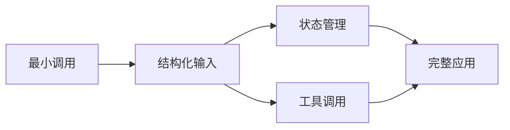

# 课程设计规则

本文件用于把学习主题拆成合理章节。先做知识依赖设计，再决定目录数量。

## 1. 从可验证的结果倒推

把“理解某主题”改写成 3～5 个可以观察的动作，例如：

- 能运行一个最小示例并解释输入、处理和输出；
- 能修改一个参数并预测行为变化；
- 能从错误信息定位配置或调用问题；
- 能把多个概念组装成一个小型最终项目。

章节不是文档目录，而是为这些动作提供必要知识的最短路径。

## 2. 建立概念依赖

先列出核心概念，再回答：

- 哪些概念没有它就无法理解后续内容？
- 哪些只是并列能力，可以放在分支章节？
- 哪些属于生产扩展，不应进入入门主线？

线性课程直接用表格即可。只有出现三条以上分支或汇合关系时才画 Mermaid：

## 3. 每章只新增一个主要概念

“一个概念”指学习者需要建立的一个新心智模型，不等于只允许一个函数或类。

合格章节示例：

- 第 1 章只建立“最小请求和响应”；
- 第 2 章在相同场景中只增加“结构化参数”；
- 第 3 章只增加“状态如何跨调用保存”。

需要拆章的信号：标题里出现多个并列的新术语，或者解释任何一部分都必须先额外讲另一套机制。

## 4. 使用统一贯穿案例

选择一个足够小、但可以自然增加能力的场景。统一案例可以减少业务背景切换，让学习者看到框架能力如何逐层出现。

案例应满足：

- 不依赖真实业务系统；
- 输入和结果肉眼可判断；
- 能用内存数据或小文件模拟；
- 最终章能够组装前面概念；
- 不为了贴合案例扭曲框架的正常用法。

每章可以复用相同假数据，但不得依赖上一章运行后留下的文件、数据库或远程状态。

## 5. 知识先行，再过渡到代码与实践

每章先建立完成实践所需的最小心智模型，再用代码验证它。推荐的单章学习循环：

1. 用 1～2 个短问题回顾前置知识，发现缺口时先补齐；
2. 讲清本章唯一新增概念：它解决什么问题，输入、处理过程、输出和适用边界分别是什么；
3. 给一个完整且极小的 worked example，由导师示范推理过程；
4. 把知识逐项映射到关键变量、函数和数据流，只解释决定行为的代码；
5. 让学习者预测关键输出，再运行代码并比较预测与结果；
6. 师生共同完成一个单变量修改，然后由学习者独立完成一个相邻变式；
7. 暂离代码，用 2～3 个检索问题和自我解释检查真正理解；
8. 写出常见错误、判断方法和本章边界。

“知识先行”不等于先堆一页术语。知识块应小到学习者能在一次对话中复述；代码用于验证和迁移知识，而不是替代讲解。初学者先看完整示例，再做部分完成的练习，最后才独立修改，逐步撤掉提示。详细依据见 [teaching-method.md](teaching-method.md)。

## 6. 离线核心与在线扩展分层

只要主题允许，前几章应使用标准库、内存假数据或本地替身，以便学习者零成本反复运行。外部 API 是核心概念时：

- 先用本地替身展示调用契约或控制流；
- 再单独用一章接入真实服务；
- 把密钥、费用、网络和数据外发风险写进大纲与 README；
- 不把在线调用成功作为理解本地机制的前置条件。

## 7. 控制课程规模

默认 5～7 章：

1. 最小可运行入口；
2. 第一个核心抽象；
3. 常见组合或状态；
4. 分支、错误或调试；
5. 完整小项目；
6～7. 仅在确有独立学习目标时加入观测、测试或真实集成。

如果必须超过 7 章，先考虑拆成基础篇和进阶篇。不要把安装、总结和纯理论介绍伪装成独立代码章节。

## 8. 大纲验收

大纲中的每一行都应能回答：

- 本章唯一新增的心智模型是什么？
- 运行什么命令？
- 学习者能观察到什么变化？
- 为什么它必须排在这里？
- 是否需要网络、凭据或费用？

答不上来时先修改大纲，不要进入代码生成。
